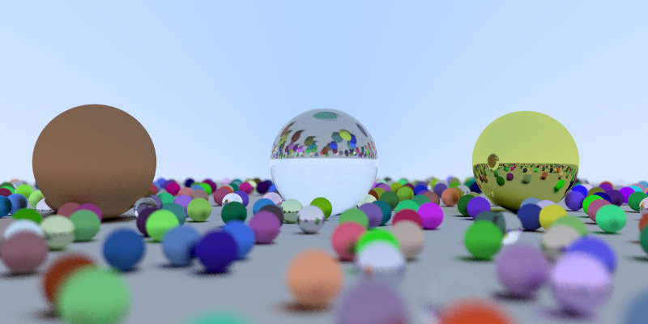

# Weekend Raytracer
An exercise following the "[Ray Tracing in One Weekend](https://raytracing.github.io/books/RayTracingInOneWeekend.html)" book.

In Rust.

For fun.

Here's the result after following Book 1.

